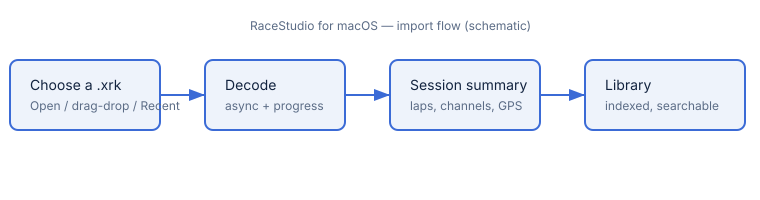

# Getting started — importing a session

RaceStudio for macOS opens `.xrk` sessions recorded by AiM data loggers (MyChron,
Solo, and similar). This chapter takes you from a fresh launch to a decoded
session sitting in your library (milestone **M2**, issues 2.1–2.5).

## What you need

- A `.xrk` file exported from your logger (or copied from its memory card), **or**
  a logger you can reach over WiFi — see
  [Downloading from a connected device](04-device-download.md).
- macOS 13 or later. The app runs in the **App Sandbox**, so it only reads files
  you explicitly grant it (via the Open panel, drag-and-drop, or a remembered
  Recent Files bookmark).

## Import a `.xrk`, step by step

1. **Launch RaceStudio.** It opens on the **session library** — a browser of every
   session you have already imported (empty on first run).
2. **Start an import** in whichever way suits you:
   - choose **File ▸ Open…** (⌘O) and pick a `.xrk`; or
   - **drag** a `.xrk` from Finder onto the library window; or
   - pick a recent file from **File ▸ Open Recent** (these are security-scoped
     bookmarks, so they keep working across launches).
3. **Watch the decode progress.** Decoding runs asynchronously with a progress
   indicator you can **cancel**; the UI stays responsive on large sessions.
4. **Review the session summary.** When the decode finishes you get a summary —
   lap count and lap times, the channel list, GPS presence, and sample rates.
5. **Find it in the library.** The session is added to the searchable library
   index (content-id-keyed), so it reopens instantly next time without re-decoding.

If a file fails to decode, RaceStudio shows a **typed error** rather than failing
silently — see [Troubleshooting](05-troubleshooting.md).

## Next

- Open the session into the [analysis views](02-analysis-views.md) to plot and
  compare laps.
- Build your own channels in [Math channels & the expression language](03-math-channels.md).
