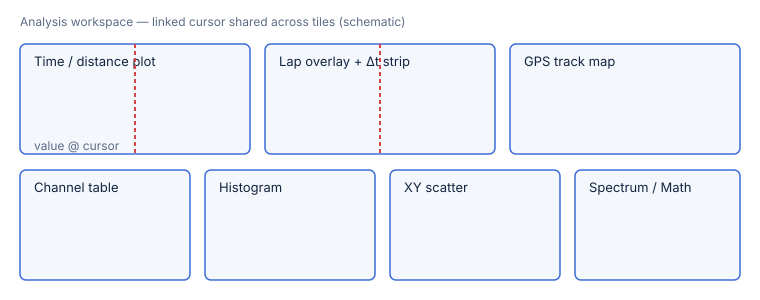

# Analysis views

Once a session is imported, open it into the **analysis workspace** — a set of
tiled views that all share one **linked cursor**: move it in any tile and every
other tile updates to the same point in time/distance (milestones **M3** analysis
engine and **M4** analysis UI, issues 3.1–3.8 and 4.1–4.7).

## Open a session for analysis

1. In the **library**, select a session and open it (double-click, or ⌘O on the
   selection).
2. The **workspace** opens with the default tiles laid out and a lap selected.
3. **Move the cursor** — hover or click in any tile. The delta strip, readouts,
   track-map dot, and tables all follow the same cursor position.
4. **Pick laps to compare** in the lap overlay; the delta-t strip shows where time
   is won or lost between them.

## The views

| View | What it shows |
|---|---|
| **Time / distance plot** | One or more channels against time or distance, the core trace view. |
| **Lap overlay + Δt strip** | Two or more laps overlaid, with a delta-t strip (time gained/lost vs a reference lap). |
| **GPS track map** | The racing line drawn from GPS, colorable by a channel (e.g. speed). |
| **Channel table** | A channels × laps grid of the value **at the cursor**, plus digital readouts. |
| **Histogram** | Distribution of a channel's samples (equal-count or fixed-width bins). |
| **XY scatter** | One channel against another, with a fitted trend line. |
| **Spectrum** | A windowed FFT amplitude-vs-frequency plot (e.g. for suspension/vibration). |
| **Math editor** | Author a derived channel live — see [Math channels](03-math-channels.md). |

Statistics (min/max/mean/standard deviation, per lap or over a selected range) are
computed with a numerically stable (Welford) method and shown alongside the tables.

## Notes

- Large sessions stay responsive: the engine exposes **windowed** queries and
  min/max decimation, so a tile only fetches the samples it needs to draw.
- The exact mapping of RS3 analysis features to what has shipped here is tracked
  in the [parity matrix](../PARITY_MATRIX.md).

## Next

- Learn the expression language in [Math channels](03-math-channels.md).
- Back to [importing a session](01-getting-started-import.md).
