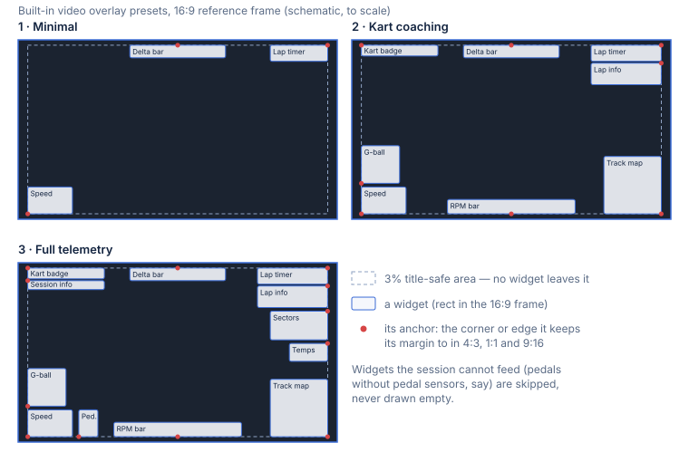

# Analysis views

Once a session is imported, open it into the **analysis workspace** — a set of
tiled views that all share one **linked cursor**: move it in any tile and every
other tile updates to the same point in time/distance (milestones **M3** analysis
engine and **M4** analysis UI, issues 3.1–3.8 and 4.1–4.7).

## Open a session for analysis

1. In the **library**, select a session and open it (double-click, or ⌘O on the
   selection).
2. The **workspace** opens with the default tiles laid out and a lap selected.
3. **Move the cursor** — hover or click in any tile. The delta strip, readouts,
   track-map dot, and tables all follow the same cursor position.
4. **Pick laps to compare** in the lap overlay; the delta-t strip shows where time
   is won or lost between them.

## The views

| View | What it shows |
|---|---|
| **Time / distance plot** | One or more channels against time or distance, the core trace view. |
| **Lap overlay + Δt strip** | Two or more laps overlaid, with a delta-t strip (time gained/lost vs a reference lap). |
| **GPS track map** | The selected laps' racing lines drawn from GPS, one colour per lap or colored by a channel (e.g. speed) — see below. |
| **Channel table** | A channels × laps grid of the value **at the cursor**, plus digital readouts. |
| **Histogram** | Distribution of a channel's samples (equal-count or fixed-width bins). |
| **XY scatter** | One channel against another, with a fitted trend line. |
| **Spectrum** | A windowed FFT amplitude-vs-frequency plot (e.g. for suspension/vibration). |
| **Math editor** | Author a derived channel live — see [Math channels](03-math-channels.md). |
| **Video review** | The session's onboard video tied to the cursor, reviewed lap by lap and sector by sector — see below. |

Statistics (min/max/mean/standard deviation, per lap or over a selected range) are
computed with a numerically stable (Welford) method and shown alongside the tables.

## GPS track map

The map draws the racing line of every **selected lap**, so select two or more
laps to compare the lines you took.

- **One colour per lap.** With two or more laps selected, each line takes the
  lap's colour from everywhere else in the window, and a legend in the corner says
  which is which. The **Colour** menu switches the line to a channel gradient
  (speed, say) instead, or back to **By lap**.
- **One dot per lap.** Each selected lap gets a dot at the same time into the lap
  as the cursor, and the lap the cursor is in has the largest. The distance
  between the dots is how far one lap was ahead of the other at that moment, so
  scrubbing through a lap shows where time was won or lost. A lap that had already
  finished shows its dot at the line with a white centre.
- **Zoom and move.** Scroll the mouse wheel to zoom in and out around the pointer,
  and drag with the wheel pressed (the middle button) to move the map. A trackpad
  pinch also zooms, and ⌥-drag also moves. The buttons at the bottom right do the
  same, and the last one fits the laps back into view. A plain click or drag moves
  the cursor.
- **Satellite imagery.** The **Map** menu adds satellite, road or hybrid imagery
  under the line. It is off by default because it needs an internet connection.
  The imagery scales with the zoom, so it stays under the line at any zoom, getting
  softer once you zoom in past the detail the satellite images have.

## Video review

Attach the onboard video for a session and review it against the data, one
section at a time.

1. **Attach the footage.** Pick **Video** in the left rail, then **Import
   Video…** and choose the file. It is remembered by bookmark, so saving the
   workspace (`.rsproj`) and reopening it later brings the same video back,
   aligned exactly as you left it.
2. **Sync it to the track data.** If the camera stamped a creation time and the
   log carries a date, an opening alignment is proposed automatically from those
   two clocks. Otherwise — or to correct it — select a lap or sector, scrub the
   footage to the frame where that section actually begins, and press **Sync to
   Section**. The offset is exact and unbounded, so a camera started minutes
   before the logger aligns fine; the slider then trims ±60 s around it. See
   [Syncing the video precisely](#syncing-the-video-precisely) below.
3. **Review section by section.** The grid on the right is one row per lap and
   one cell per split, showing the time spent in each (the same numbers the
   **Splits** report shows — both are summed from one base grid,
   so they cannot disagree). Click a cell to send the cursor **and** the playhead
   to that section; the fastest time in each column is highlighted.
4. **Compare one section across laps.** With a sector selected, **Lap +** /
   **Lap −** hold that section and move through the laps — the same corner, lap
   after lap. **Play Section** plays exactly the selected window, and **Loop
   Section** repeats it.

While the footage plays it drives the shared cursor, so every other panel
follows; while it is paused, scrubbing the plot seeks the video instead. A
section the footage does not cover is dimmed and cannot be played, rather than
seeking to a wrong frame.

### Syncing the video precisely

- **Why the file date can be wrong.** The proposed alignment comes from the
  video file's creation date. A clip that was re-exported, trimmed or copied
  carries the date it was *exported*, which can be days after the session. When
  the date would leave the footage covering no part of the session, nothing is
  proposed. The panel says *"The video’s date doesn’t match this session — align
  it on a lap start"* instead, so align it on a lap as described above. A date
  never replaces an alignment you made yourself.
- **Auto-sync from engine sound.** When the session has an `RPM` channel and the
  video has sound, press **Auto-sync from Engine Sound**. RaceStudio listens to
  the engine in the footage and lines its pitch up with the session's RPM. It
  works for any engine (two- or four-stroke, any cylinder count), with nothing
  to configure. The button has its own row under the anchor controls; a
  progress bar shows beside it while it reads the audio and matches it.
  **Cancel** stops it at any point and leaves your current sync exactly as it
  was, and so does removing the video or closing the window. A ten-minute clip
  takes about a second. Pressing the button again during a run starts over.
  VoiceOver reads the result out when it arrives.
  - When the match is clear, the result shows the proposed offset and a
    confidence bar. Press **Apply** to use it, or **Dismiss** to keep what you
    have. It is never applied on its own.
  - When the engine sound does not line up clearly enough — wind or another
    kart drowning the engine, or a clip that covers only a lap or two of
    near-identical laps — it says *No confident match* and offers nothing to
    apply; align on a lap start instead.
  - The button is greyed out, with the reason in its tooltip, when the session
    has no RPM channel or the video has no audio track. Clips or sessions
    longer than three hours are not matched.
  - An applied auto-sync can still be trimmed frame by frame or replaced by a
    two-point sync. Check it once against a lap start line: scrub to the frame
    where the kart crosses the line and compare it with the lap's start time.
  - How it works, and when it cannot be trusted:
    [ADR 0007 — video sync from engine sound](../adr/0007-audio-engine-sync.md).
- **Frame stepping.** Trim the offset one frame at a time with `,` (back) and `.`
  (forward), or with the buttons beside the slider (their tooltips name the
  keys). A frame is one frame of *this* footage, at its own frame rate: at
  29.97 fps it is 1001/30000 s, so the readout moves by 0.033 s. Every step moves
  exactly one frame, so a lap you synced on a frame stays on a frame. Hold `⇧` to
  step 0.1 s instead, or `⌥` to step 1 s.
- **Two-point sync.** A camera's clock and the logger's drift apart slightly, by
  up to a frame or two over a long stint, and one offset cannot correct that.
  Select an early lap, scrub to the frame where the kart crosses the line, and
  press **Set Anchor A**. Then do the same on a late lap with **Set Anchor B**,
  and press **Two-Point Sync**. Both the offset and the clock rate are solved so
  that both crossings land exactly on their frames, and the laps in between are
  corrected in proportion. The anchors must be at least 10 s apart. A pair that
  implies more than a ±0.5% clock difference is rejected, because it means one
  anchor is on the wrong frame or lap, and the previous sync is kept. The solved
  rate shows after the offset in the readout (for example `×1.000083`). A later
  **Sync to Section** or trim moves the offset but keeps that rate.
- **Sync status.** The line under the controls says how the footage is aligned:
  *Not synced*, *Estimated from file date*, *Synced by hand*, *Synced on lap 3*,
  *Synced on lap 3 + lap 14*, or *Synced from engine sound (91%)*. It also says
  how many laps the footage covers in
  full, for example *footage covers laps 2–15 (14 of 16)*. It updates after every
  sync action. Saving the workspace keeps the offset, the clock rate and the
  status.

## Video overlay layouts

A **video overlay** is a layout of telemetry widgets drawn over the footage:
speed, an RPM bar, the lap timer, a delta bar, a G-ball, a mini track map, your
kart's badge and more. One layout drives both the live display over the player
and the exported MP4, so what you preview is what you export. *Picking, editing
and exporting an overlay arrive with the Video + Data view and the overlay
export; this section describes the layouts they share.*

Three presets are built in:

| Preset | Widgets |
|---|---|
| **Minimal** | speed, lap timer, delta bar |
| **Kart coaching** | speed, RPM bar, delta bar, lap info (lap n · last · best), G-ball, mini track map, kart badge |
| **Full telemetry** | everything in Kart coaching, plus session info, sector times, temperatures and pedals |

- **Any frame shape.** Layouts are drawn in a 16:9 frame. For a 4:3, square
  (1:1) or vertical (9:16) video, each widget keeps its distance to its
  **anchor** (the corner or edge marked in the figure) and keeps its shape, and
  no widget leaves the 3% title-safe area. In a narrower frame a widget keeps
  its share of the width and gets shorter to keep its shape (in a wider frame,
  its share of the height), shrinking toward its anchor. Widgets that don't
  overlap in 16:9 therefore never overlap in another shape.
- **Only what the session has.** Each widget needs data: the RPM bar needs an
  RPM channel, the map a GPS track, and the kart badge a kart from your garage
  (it reads, for example, *F4 · Thunder · RBC Honda · 18 HP*). A widget the
  session cannot feed is left out instead of being drawn empty, and the reason is
  given, for example *No throttle or brake channel*. A widget with half its data
  shows that half, saying so: a kart with only a brake sensor gets *No throttle
  channel; showing brake only*. A MyChron kart session usually has speed, RPM, G
  and the logger's delta, but no pedal or engine-temperature channels.
- **Units.** A layout shows metric (km/h, °C) or imperial (mph, °F) values, and
  a single widget can use the other system.
- **How it is drawn.** Readouts are set in a condensed face with fixed-width
  digits, so a running lap time never jitters. A thin dark outline keeps them
  readable over bright footage, even on a widget without a plate.
  - A value the session cannot give at that moment shows a dash (—), never a
    stale or zero value; for example, a sensor gap or the time before the
    first lap.
  - Numbers use the decimal mark of the language chosen for the export:
    *1:02.345* in English, *1:02,345* in Brazilian Portuguese. The labels
    follow it too: *LAST / BEST*, or *ÚLTIMA / MELHOR*.
  - The delta bar fills right in red while you lose time and left in green
    while you gain it.
  - The RPM bar's shift light comes on at the widget's shift RPM.
  - A pedal bar is full at 100, so it reads its channel as a percentage of
    travel. A layout can store another full scale for each pedal, such as the
    pressure at full braking for a brake logged in bar. Until the overlay
    editor offers that setting, a brake logged in bar is drawn against 100.
  - The G-ball shows lateral G across and acceleration upwards (braking
    downwards), with rings at 0.5 g and 1 g and a one-second trail.
- **Saved with the workspace.** The overlay is saved in the `.rsproj`. A
  workspace saved before overlays existed opens with the overlay off.
- **Your own presets.** Your own layouts are kept in `OverlayPresets.json` in
  RaceStudio's Application Support folder; for the sandboxed app that is
  `~/Library/Containers/com.racestudio.RaceStudio/Data/Library/Application Support/RaceStudio/`.
  A preset can't take a built-in preset's name. If the file is damaged, or holds
  a layout this version can't read, RaceStudio still opens and offers the
  built-in presets. Before the file is next rewritten, it is kept as
  `OverlayPresets.backup.json` (then `OverlayPresets.backup-2.json`, and so on).

## Notes

- Large sessions stay responsive: the engine exposes **windowed** queries and
  min/max decimation, so a tile only fetches the samples it needs to draw.
- The exact mapping of RS3 analysis features to what has shipped here is tracked
  in the [parity matrix](../PARITY_MATRIX.md).
- Video review uses the split layout from the **Splits** report, so changing the
  split count there re-cuts the review grid too.

## Next

- Learn the expression language in [Math channels](03-math-channels.md).
- Back to [importing a session](01-getting-started-import.md).
