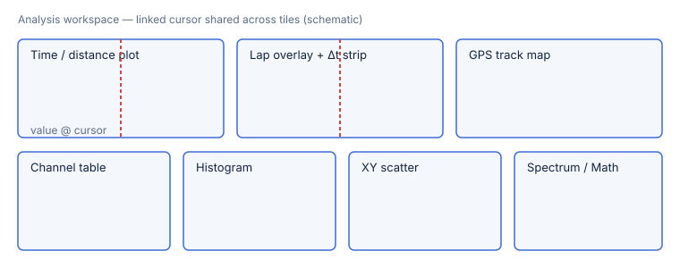

# Analysis views

Once a session is imported, open it into the **analysis workspace** — a set of
tiled views that all share one **linked cursor**: move it in any tile and every
other tile updates to the same point in time/distance (milestones **M3** analysis
engine and **M4** analysis UI, issues 3.1–3.8 and 4.1–4.7).

## Open a session for analysis

1. In the **library**, select a session and open it (double-click, or ⌘O on the
   selection).
2. The **workspace** opens with the default tiles laid out and a lap selected.
3. **Move the cursor** — hover or click in any tile. The delta strip, readouts,
   track-map dot, and tables all follow the same cursor position.
4. **Pick laps to compare** in the lap overlay; the delta-t strip shows where time
   is won or lost between them.

## The views

| View | What it shows |
|---|---|
| **Time / distance plot** | One or more channels against time or distance, the core trace view. |
| **Lap overlay + Δt strip** | Two or more laps overlaid, with a delta-t strip (time gained/lost vs a reference lap). |
| **GPS track map** | The selected laps' racing lines drawn from GPS, one colour per lap or colored by a channel (e.g. speed) — see below. |
| **Channel table** | A channels × laps grid of the value **at the cursor**, plus digital readouts. |
| **Histogram** | Distribution of a channel's samples (equal-count or fixed-width bins). |
| **XY scatter** | One channel against another, with a fitted trend line. |
| **Spectrum** | A windowed FFT amplitude-vs-frequency plot (e.g. for suspension/vibration). |
| **Math editor** | Author a derived channel live — see [Math channels](03-math-channels.md). |
| **Video review** | The session's onboard video tied to the cursor, reviewed lap by lap and sector by sector — see below. |

Statistics (min/max/mean/standard deviation, per lap or over a selected range) are
computed with a numerically stable (Welford) method and shown alongside the tables.

## GPS track map

The map draws the racing line of every **selected lap**, so select two or more
laps to compare the lines you took.

- **One colour per lap.** With two or more laps selected, each line takes the
  lap's colour from everywhere else in the window, and a legend in the corner says
  which is which. The **Colour** menu switches the line to a channel gradient
  (speed, say) instead, or back to **By lap**.
- **One dot per lap.** Each selected lap gets a dot at the same time into the lap
  as the cursor, and the lap the cursor is in has the largest. The distance
  between the dots is how far one lap was ahead of the other at that moment, so
  scrubbing through a lap shows where time was won or lost. A lap that had already
  finished shows its dot at the line with a white centre.
- **Zoom and move.** Scroll the mouse wheel to zoom in and out around the pointer,
  and drag with the wheel pressed (the middle button) to move the map. A trackpad
  pinch also zooms, and ⌥-drag also moves. The buttons at the bottom right do the
  same, and the last one fits the laps back into view. A plain click or drag moves
  the cursor.
- **Satellite imagery.** The **Map** menu adds satellite, road or hybrid imagery
  under the line. It is off by default because it needs an internet connection.
  The imagery scales with the zoom, so it stays under the line at any zoom, getting
  softer once you zoom in past the detail the satellite images have.

## Video review

Attach the onboard video for a session and review it against the data, one
section at a time.

1. **Attach the footage.** Pick **Video** in the left rail, then **Import
   Video…** and choose the file. It is remembered by bookmark, so saving the
   workspace (`.rsproj`) and reopening it later brings the same video back,
   aligned exactly as you left it.
2. **Sync it to the track data.** If the camera stamped a creation time and the
   log carries a date, an opening alignment is proposed automatically from those
   two clocks. Otherwise — or to correct it — select a lap or sector, scrub the
   footage to the frame where that section actually begins, and press **Sync to
   Section**. The offset is exact and unbounded, so a camera started minutes
   before the logger aligns fine; the slider then trims ±60 s around it. See
   [Syncing the video precisely](#syncing-the-video-precisely) below.
3. **Review section by section.** The grid on the right is one row per lap and
   one cell per split, showing the time spent in each (the same numbers the
   **Splits** report shows — both are summed from one base grid,
   so they cannot disagree). Click a cell to send the cursor **and** the playhead
   to that section; the fastest time in each column is highlighted.
4. **Compare one section across laps.** With a sector selected, **Lap +** /
   **Lap −** hold that section and move through the laps — the same corner, lap
   after lap. **Play Section** plays exactly the selected window, and **Loop
   Section** repeats it.

While the footage plays it drives the shared cursor, so every other panel
follows; while it is paused, scrubbing the plot seeks the video instead. A
section the footage does not cover is dimmed and cannot be played, rather than
seeking to a wrong frame.

### Syncing the video precisely

- **Why the file date can be wrong.** The proposed alignment comes from the
  video file's creation date. A clip that was re-exported, trimmed or copied
  carries the date it was *exported*, which can be days after the session. When
  the date would leave the footage covering no part of the session, nothing is
  proposed. The panel says *"The video’s date doesn’t match this session — align
  it on a lap start"* instead, so align it on a lap as described above. A date
  never replaces an alignment you made yourself.
- **Frame stepping.** Trim the offset one frame at a time with `,` (back) and `.`
  (forward), or with the buttons beside the slider (their tooltips name the
  keys). A frame is one frame of *this* footage, at its own frame rate: at
  29.97 fps it is 1001/30000 s, so the readout moves by 0.033 s. Every step moves
  exactly one frame, so a lap you synced on a frame stays on a frame. Hold `⇧` to
  step 0.1 s instead, or `⌥` to step 1 s.
- **Two-point sync.** A camera's clock and the logger's drift apart slightly, by
  up to a frame or two over a long stint, and one offset cannot correct that.
  Select an early lap, scrub to the frame where the kart crosses the line, and
  press **Set Anchor A**. Then do the same on a late lap with **Set Anchor B**,
  and press **Two-Point Sync**. Both the offset and the clock rate are solved so
  that both crossings land exactly on their frames, and the laps in between are
  corrected in proportion. The anchors must be at least 10 s apart. A pair that
  implies more than a ±0.5% clock difference is rejected, because it means one
  anchor is on the wrong frame or lap, and the previous sync is kept. The solved
  rate shows after the offset in the readout (for example `×1.000083`). A later
  **Sync to Section** or trim moves the offset but keeps that rate.
- **Sync status.** The line under the controls says how the footage is aligned:
  *Not synced*, *Estimated from file date*, *Synced by hand*, *Synced on lap 3*,
  or *Synced on lap 3 + lap 14*. It also says how many laps the footage covers in
  full, for example *footage covers laps 2–15 (14 of 16)*. It updates after every
  sync action. Saving the workspace keeps the offset, the clock rate and the
  status.

## Notes

- Large sessions stay responsive: the engine exposes **windowed** queries and
  min/max decimation, so a tile only fetches the samples it needs to draw.
- The exact mapping of RS3 analysis features to what has shipped here is tracked
  in the [parity matrix](../PARITY_MATRIX.md).
- Video review uses the split layout from the **Splits** report, so changing the
  split count there re-cuts the review grid too.

## Next

- Learn the expression language in [Math channels](03-math-channels.md).
- Back to [importing a session](01-getting-started-import.md).
