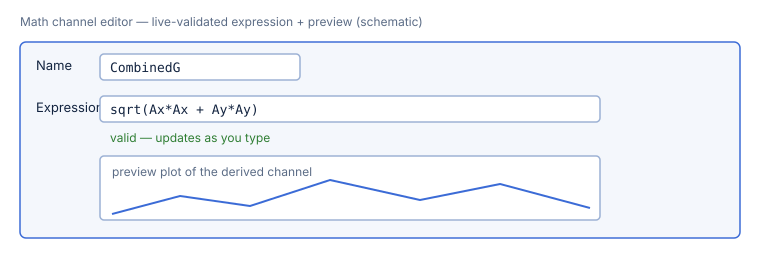

# Math channels & the expression language

A **math channel** is a channel you define with an expression over the session's
existing channels — for example a combined-G magnitude from the two accelerometer
axes. RaceStudio evaluates it per sample with the same panic-free engine used
throughout the analysis layer (milestone **M3**, issue 3.5; live editor 4.6).

## Add a math channel, step by step

1. Open a session into the [analysis workspace](02-analysis-views.md) and open the
   **math editor**.
2. Give the channel a **name** (e.g. `CombinedG`).
3. Type an **expression** (e.g. `sqrt(Ax*Ax + Ay*Ay)`). The editor validates as you
   type: a mistake shows an inline diagnostic pointing at the exact character.
4. Watch the **preview plot** update, then **apply** to add the channel — it now
   behaves like any recorded channel in the plots, tables, and statistics.

## The expression language

The grammar is small and whitespace-insensitive.

- **Numbers** — decimals with optional scientific notation: `10`, `9.81`, `1e-3`,
  `2.5E2`.
- **Channels** — bare identifiers refer to channels by name. Identifiers are
  C-style: a letter or `_` followed by letters, digits, or `_` (e.g. `Ax`,
  `GPS_Speed`, `rpm`).
- **Operators** — the four arithmetic operators and unary minus:

  | Operator | Meaning | Precedence |
  |---|---|---|
  | `*` `/` | multiply, divide | higher |
  | `+` `-` | add, subtract | lower |
  | unary `-` | negation | highest |

  `*` and `/` bind tighter than `+` and `-`; both are left-associative; parentheses
  override. So `2 + 3 * 4` is `14`, while `(2 + 3) * 4` is `20`.

- **Grouping** — parentheses, nested to any depth.

### Built-in functions

The engine ships exactly these functions (an unknown name is a typed error, not a
silent zero). The `Arity` column is the required number of arguments.

| Function | Arity | Description |
|---|---|---|
| `abs(x)` | 1 | Absolute value. |
| `sqrt(x)` | 1 | Square root. |
| `sin(x)` | 1 | Sine, argument in radians. |
| `cos(x)` | 1 | Cosine, argument in radians. |
| `tan(x)` | 1 | Tangent, argument in radians. |
| `log(x)` | 1 | Natural logarithm (base *e*). |
| `exp(x)` | 1 | Exponential, *e*x. |
| `min(a, b)` | 2 | The smaller of two values. |
| `max(a, b)` | 2 | The larger of two values. |
| `pow(a, b)` | 2 | `a` raised to the power `b`. |
| `clamp(x, lo, hi)` | 3 | `x` limited to the range `[lo, hi]`. |

### Division by zero & errors

- **Division by zero** follows IEEE-754: it yields `±∞` or `NaN`, never a crash or
  an error. This is a deliberate, tested policy so a momentary zero in a divisor
  channel can't abort a whole trace.
- Every other malformed input is a **typed error** carrying a 1-based
  `line:column` — a bad character, an unexpected/missing token, an unknown
  identifier (channel or function), an unbalanced parenthesis, or a function
  called with the wrong number of arguments. The editor surfaces it inline.

## Worked examples

Every example below is checked in `handbook_math_examples.txt` and evaluated
through the **real engine** by `test_worked_examples_evaluate`, so it can never
drift from what RaceStudio actually computes. The `With` column lists the channel
values used where an example references channels.

| Expression | With | Result |
|---|---|---|
| `2 + 3 * 4` | — | 14 |
| `(2 + 3) * 4` | — | 20 |
| `100 / 5 / 2` | — | 10 |
| `abs(-9.81)` | — | 9.81 |
| `sqrt(pow(3, 2) + pow(4, 2))` | — | 5 |
| `min(2, 5)` | — | 2 |
| `max(2, 5)` | — | 5 |
| `pow(2, 10)` | — | 1024 |
| `clamp(120, 0, 100)` | — | 100 |
| `sqrt(Ax*Ax + Ay*Ay)` | Ax=3, Ay=4 | 5 |
| `2 * v + 1` | v=10 | 21 |
| `GPS_Speed / 3.6` | GPS_Speed=90 | 25 |

The last row is the classic km/h → m/s conversion; the combined-G example
(`sqrt(Ax*Ax + Ay*Ay)`) is the 3–4–5 right triangle.

## Next

- Back to the [analysis views](02-analysis-views.md).
- On to [downloading from a device](04-device-download.md).
