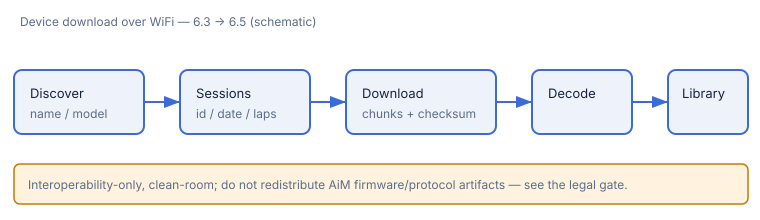

# Downloading from a connected device

RaceStudio can import sessions **directly from an AiM logger over WiFi** — discover
the device, list the sessions it holds, and download one into a decodable `.xrk`
(milestone **M6**, issues 6.1–6.7).

## Before you start — legal & interoperability note

Device connectivity is built from a **clean-room, interoperability-only**
reverse-engineering effort, gated by an explicit legal decision. Please read it:

- the decision record: [ADR 0006 — device WiFi reverse-engineering](../adr/0006-device-wifi-reverse-engineering.md);
- the guard rails: [legal gate](../device/LEGAL_GATE.md) (DMCA §1201(f) /
  EU 2009/24/EC Art. 6, a `needs-legal-review` sign-off, and a **do-not-redistribute**
  guard enforced in CI).

**Do not redistribute** AiM firmware, protocol captures, or any derived binary
artifacts. The protocol details live in
[CAPTURE.md](../device/CAPTURE.md) and [PROTOCOL.md](../device/PROTOCOL.md).

## Download a session, step by step

1. **Prepare the logger.** Put it on the **same WiFi** as your Mac (join the
   logger's access point, or put both on the same network), and make sure it is
   **holding sessions** (visible under its on-board Data tab).
2. **Open the device panel** in RaceStudio.
3. **Discover.** The panel scans and lists reachable devices by name and model.
   Select yours.
4. **Review the session list.** RaceStudio requests the catalog and shows each
   session's id, date, lap count, and size. (An empty logger shows an explicit
   empty state.)
5. **Download.** Choose a session and start the download. RaceStudio reassembles
   the transfer chunk-by-chunk with per-chunk **checksums** and a whole-file
   verification, showing a 0→100% progress bar; it retries a bad chunk and handles
   out-of-order/duplicate/missing chunks.
6. **Decode & save.** The reassembled `.xrk` is decoded and added to your library,
   exactly like a file [imported from disk](01-getting-started-import.md).

## Deleting a session from the device (guarded)

Deleting is a **destructive** write and is guarded accordingly: RaceStudio sends
**nothing** unless you explicitly arm the action **and** re-type the target
session's exact name to confirm. Cancelling sends no traffic, and it never blindly
retries a delete (no accidental double-delete).

## Hardware-capture caveats

Some record layouts are **documented hypotheses** pending a re-capture against a
logger that actually holds sessions (the reference capture's store was empty):

- the dated session-record layout (6.4, [#130](https://github.com/Zenardi/racestudio-macos/issues/130));
- the multi-chunk download stream (only one real chunk was captured; 6.5,
  [#133](https://github.com/Zenardi/racestudio-macos/issues/133));
- the delete opcode and its ack/reject response (6.6, [#130](https://github.com/Zenardi/racestudio-macos/issues/130)).

Each is built on **verified** STCP framing and is called out in the code and tests.

## Next

- If discovery or download misbehaves, see [Troubleshooting](05-troubleshooting.md).
