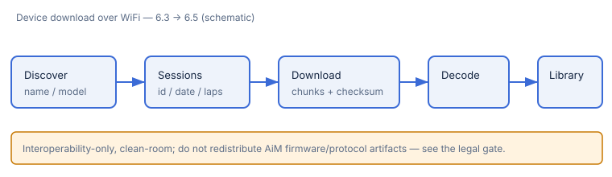

# Downloading from a connected device

RaceStudio can import sessions **directly from an AiM logger over Wi-Fi**: find the
logger, list the sessions it holds, and download them into your library
(milestone **M6**, issues 6.1–6.7 and
[#179](https://github.com/Zenardi/racestudio-macos/issues/179)).

## Before you start — legal & interoperability note

Device connectivity is built from a **clean-room, interoperability-only**
reverse-engineering effort, gated by an explicit legal decision. Please read it:

- the decision record: [ADR 0006 — device WiFi reverse-engineering](../adr/0006-device-wifi-reverse-engineering.md);
- the guard rails: [legal gate](../device/LEGAL_GATE.md) (DMCA §1201(f) /
  EU 2009/24/EC Art. 6, a `needs-legal-review` sign-off, and a **do-not-redistribute**
  guard enforced in CI).

**Do not redistribute** AiM firmware, protocol captures, or any derived binary
artifacts. The protocol details live in
[CAPTURE.md](../device/CAPTURE.md) and [PROTOCOL.md](../device/PROTOCOL.md).

## Download sessions, step by step

1. **Join the logger's Wi-Fi.** A MyChron is its own access point: turn on its
   Wi-Fi, then pick its network (named `AiM-MYC…`) from the Mac's Wi-Fi menu. The
   Mac gets an address in `10.0.0.x`.
2. **Open File ▸ MyChron Device…** RaceStudio sends AiM's discovery probe and lists
   the loggers that answer. If none answers, it offers the access point's own
   address (`10.0.0.1`). The first time, macOS asks to let RaceStudio use the
   local network; allow it. If the Mac is not on a logger's network, the window
   says so.
3. **Select your logger.** RaceStudio connects and reads its catalog: one row per
   stored session with its date, track, lap count, best lap, duration, size and
   driver. A logger with no stored sessions shows an explicit empty state.
4. **Choose sessions and click Download.** Pick one or several rows (or **Select
   All**). They download one after another with a progress bar and an
   "n of m" count. Every chunk is checksum-verified and its length checked; a
   corrupt chunk is asked for again.
5. **Find them in the library.** Each finished download is decoded and added to
   your library exactly like a file [imported from disk](01-getting-started-import.md),
   named after its date and track.

**Downloading never changes the logger.** RaceStudio only sends read commands: your
sessions stay on the device until you remove them with AiM's own tools.

**When something goes wrong.** **Cancel** stops the queue at once and nothing
partial is imported. If a session fails (the link drops, or the file doesn't
decode), the queue moves on to the next one; the summary lists what failed and why,
and **Retry** queues the failed and skipped sessions again.

## What is verified

Every command RaceStudio sends is reproduced byte-for-byte from a recorded
conversation between AiM's app and a MyChron 6, and an in-process fake logger
replays that conversation in the test suite. Two parts of the protocol are still
unobserved and are called out in the code and tests:

- how the logger re-sends a chunk after a checksum failure (the recorded transfer
  had none; RaceStudio asks for the same offset again);
- deleting a session, which RaceStudio does not offer
  ([#130](https://github.com/Zenardi/racestudio-macos/issues/130)).

## Next

- If discovery or download misbehaves, see [Troubleshooting](05-troubleshooting.md).
