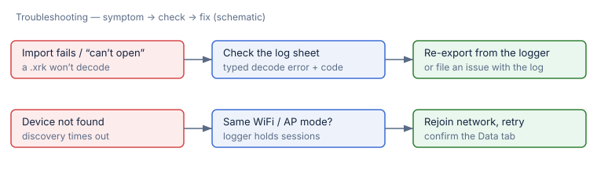

# Troubleshooting

When something does not behave, RaceStudio tries to fail **loudly and specifically**
rather than silently — a typed error, an inline diagnostic, or an explicit empty
state. This chapter maps the common symptoms to a check and a fix.

## A `.xrk` won't import

1. **Read the error.** Import failures surface a **typed decode error** (with a
   code), not a generic "couldn't open". Note what it says.
2. **Confirm the file.** Make sure it is a complete `.xrk` (not still copying off a
   memory card, and not truncated). Re-export from the logger if in doubt.
3. **Check permissions.** Because the app is sandboxed, it can only read files you
   granted via the Open panel, drag-and-drop, or Open Recent. Re-add the file if a
   bookmark went stale.
4. Still failing? File an issue and attach the decode error text. Decode tolerances
   against the reference decoder are documented in
   [DECODE_TOLERANCES.md](../DECODE_TOLERANCES.md).

## The device isn't found

1. **Same network?** Your Mac and the logger must be on the **same WiFi** (or your
   Mac joined the logger's access point).
2. **Sessions present?** Discovery/enumeration expects the logger to be **holding
   sessions** (check its on-board Data tab).
3. **Rejoin and retry** the discovery scan. See
   [Downloading from a device](04-device-download.md) for the full flow.

## A download stalls or a session list is empty

1. An **empty list** with a healthy connection usually means the logger currently
   holds no on-board sessions — an explicit empty state, not an error.
2. A stalled download retries bad chunks automatically; if it can't verify the
   whole-file checksum it stops rather than saving a corrupt file. Retry, and keep
   the logger awake and in range.

## A math expression won't validate

1. The editor shows an **inline diagnostic at the exact character**. Common causes:
   an unknown channel or function name, an unbalanced parenthesis, or a function
   called with the wrong number of arguments.
2. Check the name and arity against the built-in list in
   [Math channels](03-math-channels.md#built-in-functions).
3. Remember division by zero is **not** an error — it yields `±∞`/`NaN` by design;
   if a derived channel shows infinities, look for a zero in a divisor channel.

## VoiceOver / Dynamic Type

Accessibility behavior (VoiceOver labels, Dynamic Type, localization) is documented
separately in [ACCESSIBILITY.md](../ACCESSIBILITY.md).

## Next

- Back to [getting started](01-getting-started-import.md).
