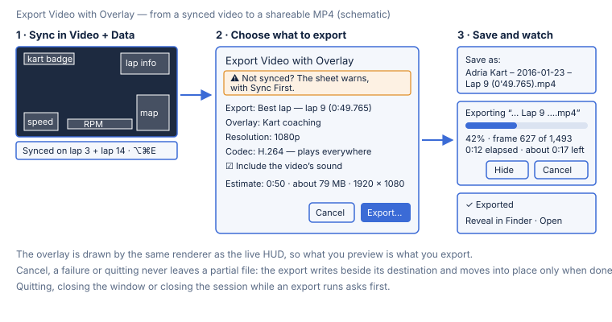

# Video sync and overlay export

Turn a session and its onboard video into one MP4 with the telemetry burned
in — speed, RPM, lap timer, delta, sector splits, G-ball, track map — ready
to share with a coach or a team. You sync the video to the session once,
arrange the overlay, and export a lap, several laps or the whole session.

## Before you export: sync the video

The overlay can only be right if the video is synced to the session. All of
this happens in [Video + Data](02-analysis-views.md#video--data):

1. **Attach the video.** Pick **Video + Data** in the left rail, then **Import
   Video…**.
2. **Sync it**, in whichever way suits the clip — see
   [Syncing the video precisely](02-analysis-views.md#syncing-the-video-precisely)
   for each in full:
   - **On a lap start.** Select a lap, scrub to the frame where the kart
     crosses the line, and press **Sync to Section**. Then trim one frame at a
     time with `,` and `.`.
   - **Two-point.** Set anchor A on an early lap and anchor B on a late one,
     then press **Two-Point Sync**. The camera's clock drift is corrected too.
   - **From the engine sound.** Press **Auto-sync from Engine Sound** and
     **Apply** a confident match.
3. **Check it.** The status line says how the video is synced — for example
   *Synced on lap 3 + lap 14* — and which laps it covers.
4. **Arrange the overlay** in [the overlay editor](02-analysis-views.md#the-overlay-editor)
   (⇧⌘E), or keep a preset — see
   [Video overlay layouts](02-analysis-views.md#video-overlay-layouts).

## Exporting

1. Choose **File ▸ Export Video with Overlay…** (⌥⌘E), or **Export Video…** in
   the Video + Data header. The command is greyed out when there is nothing to
   export yet; its tooltip says why — no video attached, a video that no
   longer opens, the session's data not loaded yet (open Video + Data once), or
   another export already running.
2. **Choose what to export:**

   | Choice | Exports |
   |---|---|
   | **Whole video** | every frame of the video |
   | **Session** | the part of the video the session covers |
   | **Best lap** | the session's fastest lap — the default when the video holds it |
   | **Selected laps** | the laps you tick, as **one clip** from the first to the last, with anything between them |
   | **Current selection** | the lap or sector selected in Video + Data |

   A choice that doesn't apply is greyed out with the reason — *Not in the
   video*, *Only partly in the video*, *No lap is wholly in the video*. In the
   lap list, a lap the video doesn't hold in full can't be ticked, and says why.
3. **Choose the overlay:** the workspace's own (**Current overlay**, as you
   arranged it in the editor) or a preset — *Minimal*, *Kart coaching* or
   *Full telemetry*. Without an overlay of its own, the workspace starts on
   *Kart coaching*. The overlay is drawn even if the HUD is hidden in Video +
   Data.
4. **Choose the output:**
   - **Resolution:** *Source* (the video's own size), *4K (2160p)*, *1080p* or
     *720p*. A video is never made larger than it is: a 1080p video exported at
     4K stays 1080p.
   - **Codec:** *H.264* plays everywhere. *HEVC* makes files about 40% smaller,
     but needs a newer player, and an HEVC encoder on this Mac.
   - **Include the video's sound** — on by default.
   - **Show the overlay, without data, outside the session** — off by default,
     so footage filmed before the logger started, or after it stopped, shows no
     overlay. On, it shows the overlay's plates with every reading a dash (—).
5. **Check the estimate.** It shows the clip's length, its size and its frame
   size — for example *0:50 · about 79 MB · 1920 × 1080* — and updates as you
   change anything.
6. Press **Export…** and choose where to save. The name is suggested from the
   track, the date and what you export — for example
   `Adria Kart – 2016-01-23 – Lap 9 (0'49.765).mp4`. A lap time is written
   `0'49.765` because a file name can't contain a colon.
7. **Watch the progress:** the percent, the frames, the time elapsed and the
   time left. The time left appears after the first few seconds and then
   settles. **Cancel** stops the export. **Hide** (or Esc — it never cancels)
   puts the sheet away while the export carries on; **Exporting 42%** in the
   workspace bar brings it back, and the result comes back on its own when the
   export ends.
8. When it's done, **Reveal in Finder** shows the file, and **Open** plays it.

The sheet remembers your last choices — what to export, the overlay,
resolution, codec and sound — for the next export. A choice that doesn't fit
the next session (a best lap the video doesn't hold, say) falls back to the
default.

## What you can count on

- **The overlay is in sync with the picture.** Each frame shows the session
  at that frame's moment, through the sync's offset and clock rate. The lap
  timer restarts on the frame where the kart crosses the line.
- **What you preview is what you export.** The live HUD and the export draw
  the overlay with the same code, at the export's own size.
- **No partial files.** The export is written to a temporary file next to its
  destination and moved into place only when it is complete. A cancel, a
  failure or quitting leaves nothing behind.
- **The app stays usable.** The export runs in the background: hide the
  progress and keep working.
- **Quitting asks first.** Quitting, closing the window or going back to Home
  while an export runs asks whether to cancel it.

## Troubleshooting

- **"This video hasn't been synced — the overlay may not match the footage."**
  The video was never synced, or only from its file date, which is often
  wrong for a clip that was re-exported or copied. Press **Sync First** to go
  to the sync controls, then export again.
- **"Not enough disk space — 3.1 GB needed, 1.2 GB free."** Finishing an export
  briefly needs room for its file **twice**, plus a margin. Free up space on
  that disk, or save to another drive.
- **"The disk filled up during the export."** Something else used the space
  while the export ran. Free up space and export again.
- **"This Mac can't encode HEVC."** Choose H.264.
- **"7680 × 4320 is too large for H.264."** H.264 tops out at 4096 pixels
  wide. Choose a lower resolution, or HEVC.
- **An HEVC file doesn't play.** Older players, some browsers and some phones
  can't play HEVC. Export again with H.264, which plays everywhere.
- **"The video can't be read."** The file moved, was deleted, or is damaged.
  Check that it still opens in QuickTime Player, then attach it again in
  Video + Data.
- **"The export can't replace the original video."** Choose another name or
  folder: the export can't overwrite the video it reads from.
- **The export is greyed out.** Hover over the menu item or the button: the
  tooltip says what is missing.

## Next

- The full sync, Video + Data and overlay reference is in
  [Analysis views](02-analysis-views.md#video--data).
- More fixes in [Troubleshooting](05-troubleshooting.md).
